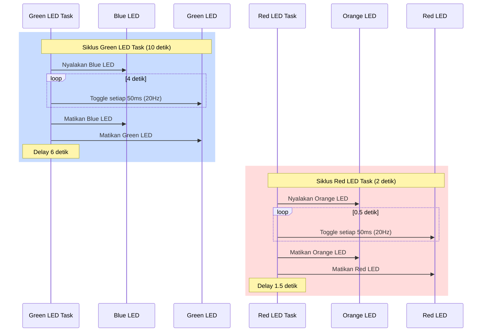

# STM32 LED Control dengan FreeRTOS

## Tentang Proyek
Proyek ini mengimplementasikan sistem kontrol LED menggunakan STM32 dengan FreeRTOS sebagai sistem operasi real-time. Program ini mengontrol empat LED (Merah, Hijau, Biru, dan Oranye) dalam pola berkedip yang terkoordinasi menggunakan multiple tasks.

## Fitur
- Menggunakan FreeRTOS untuk manajemen task
- Mengimplementasikan 3 task terpisah:
  - Default Task
  - Green LED Task
  - Red LED Task
- Kontrol LED dengan pola berkedip yang terkoordinasi
- Konfigurasi sistem clock untuk performa optimal

## Penjelasan Task

### Default Task
Task ini berjalan dengan prioritas normal dan memiliki stack size 128*4 bytes. Saat ini task ini tidak melakukan operasi spesifik dan hanya berfungsi sebagai idle task.

### Green LED Task
Task ini mengontrol LED Hijau dan Biru dengan karakteristik berikut:
- LED Biru menyala selama siklus aktif
- LED Hijau berkedip dengan frekuensi 20Hz (50ms period) selama 4 detik
- Setelah 4 detik, kedua LED mati
- Task istirahat selama 6 detik sebelum memulai siklus baru
- Berjalan dengan prioritas rendah (Low priority)

### Red LED Task
Task ini mengontrol LED Merah dan Oranye dengan karakteristik berikut:
- LED Oranye menyala selama siklus aktif
- LED Merah berkedip dengan frekuensi 20Hz (50ms period) selama 0.5 detik
- Setelah 0.5 detik, kedua LED mati
- Task istirahat selama 1.5 detik sebelum memulai siklus baru
- Berjalan dengan prioritas rendah (Low priority)

## Diagram Waktu Task

## Konfigurasi Hardware
- MCU: STM32F4
- GPIO yang digunakan:
  - Port E: RED_LED_Pin, GREEN_LED_Pin, BLUE_LED_Pin, ORANGE_LED_Pin
- Sistem Clock: 168 MHz menggunakan PLL dengan HSI sebagai sumber clock

## Cara Penggunaan
1. Clone repository ini
2. Buka proyek menggunakan STM32CubeIDE
3. Build dan flash ke board STM32 anda
4. LED akan mulai berkedip sesuai dengan pola yang telah diprogram

## Catatan
- LED menggunakan logika aktif-rendah (active-low), artinya LED menyala ketika pin dalam keadaan LOW
- Semua LED dikonfigurasi sebagai push-pull output tanpa pull-up/pull-down
- Program menggunakan HAL (Hardware Abstraction Layer) untuk akses hardware

## Kontribusi
Silakan berkontribusi ke proyek ini dengan membuat pull request. Untuk perubahan besar, harap buka issue terlebih dahulu untuk mendiskusikan apa yang ingin anda ubah.

## Lisensi
Copyright (c) 2024 STMicroelectronics.
Proyek ini dilisensikan di bawah ketentuan yang dapat ditemukan dalam file LICENSE di direktori root komponen perangkat lunak ini.
